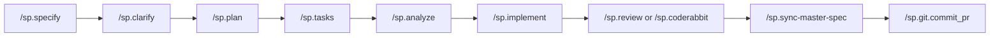

# 🚀 SDD Starter Guide

This document is a **practical onboarding guide** for the **Spec-Driven Development (SDD)** workflow used in this project.

- Core setup lives in `.specify/`
- Each feature lives in `specs/<feature>/`
- Work is fully traceable from **spec → code → review → PR**

---

# 🎯 What is SDD?

SDD is a structured development workflow:

1. **Specify** → What to build (`spec.md`)
2. **Plan** → How to build (`plan.md`)
3. **Break down** → Tasks (`tasks.md`)
4. **Implement** → Code + tests
5. **Review** → Code quality & security
6. **Ship** → Commit & PR
7. **Track** → Prompts & timeline

👉 Goal: **Clarity before coding**

---

# 🧩 Specify CLI (Spec Kit Plus) Setup

Before starting SDD, install **Specify CLI (Spec Kit Plus)**.

---

## ✅ Option 1: Persistent Installation (Recommended)

Install once and use globally:

```bash
# Install via pip
pip install specifyplus

# OR using uv
uv tool install specifyplus
```

### 🔄 Upgrade
```bash
pip install -U specifyplus

# OR using uv
uv tool upgrade specifyplus
```
### ❌ Uninstall
```bash
pip uninstall specifyplus

# OR using uv
uv tool uninstall specifyplus
```

### 🚀 Initialize Project

#### New Project
```bash
specifyplus init <PROJECT_NAME>
or
sp init <PROJECT_NAME>
```
#### Existing Project
```bash
specifyplus init . --ai cursor
# or
sp init --here --ai cursor
```
#### Verify Installation
```bash
specifyplus check
# or
sp check
```

##  Option 2: One-time Usage (No Install)
Run without installing:
```bash
uvx specifyplus --help
uvx specifyplus init <PROJECT_NAME>

# or
uvx sp init <PROJECT_NAME>
```

---

# ⚙️ Tools Overview

| Tool | Purpose |
|------|--------|
| Cursor | Run `/sp.*` commands |
| Git | Version control |
| GitHub CLI | PR creation |
| CodeRabbit | AI code review |
| Semgrep | Security scanning |
| Jira (MCP) | Ticket integration |
| Linear (MCP) | Alternative issue tracking |
| Roam Code | Code understanding |
| Entire | AI session tracking |

**MCP setup (all servers):** use **Cursor → Settings → MCP** (or project **`.cursor/mcp.json`**) to add each server, then **authenticate** when the UI prompts you. See **[MCP servers (setup summary)](#mcp-servers-setup-summary)** below.

---

<a id="mcp-servers-setup-summary"></a>

## MCP servers (setup summary)

These are **optional**. SDD commands are written to **continue** if a server is missing unless the step truly needs it (e.g. Jira fetch when you passed `--jira`).

| MCP server | What it’s for in this repo | Setup (high level) |
|------------|----------------------------|---------------------|
| **Atlassian** (Jira / Confluence) | **`/sp.specify`**: load issue with **`getJiraIssue`**, list transitions with **`getTransitionsForJiraIssue`**, move ticket to **In Progress** with **`transitionJiraIssue`**. May need **`getAccessibleAtlassianResources`** for **`cloudId`**. | In **Cursor → MCP**, add the **Atlassian** server (official or `atlassian-mcp-server`), complete **OAuth** / connection to your **Jira Cloud** site, and accept permissions for Jira (and Confluence if you use those tools). No manual `cloudId` in the guide—resolve via MCP as the command describes. |
| **Roam Code** | Structural graph of the repo (`roam_understand`, `roam_map`, …). See **[Roam Code (setup)](#roam-code-setup)**. | Python package + **`roam mcp`** in **`.cursor/mcp.json`**. |
| **Linear** | **`/sp.specify`**: alternative ticket source via **`get_issue`** when using Linear ids / `--linear`. | **Cursor → MCP → Linear**: OAuth or API key per Linear’s MCP instructions. |
| **Semgrep** | **`/sp.review`**: local **`semgrep_scan`** (and optional AppSec / supply-chain tools). | Install the **Semgrep** MCP integration from Cursor’s MCP list (often named like a Semgrep plugin). Ensure **`semgrep_scan`** appears in the tool list. Opt out in chat with **`no-semgrep`** if you want CodeRabbit only. |

**Security:** MCP servers run with the credentials you give Cursor. Use **least privilege**, **PATs** with narrow scopes, and **do not commit** secrets into `mcp.json` if your team shares the repo—prefer user-level MCP config when possible.

---

## Roam Code (setup)

[Roam Code](https://github.com/Cranot/roam-code) indexes your codebase into a **local SQLite graph** (under **`.roam/`** in the project). Cursor agents can query it through **MCP** instead of only grepping files. In this repo, **`/sp.specify`**, **`/sp.plan`**, **`/sp.tasks`**, **`/sp.implement`**, and **`/sp.analyze`** each describe optional Roam usage; [`.cursor/rules/guidelines.md`](../.cursor/rules/guidelines.md) says Roam is **never mandatory**—if MCP is missing or a tool errors, the SDD flow continues.

### 1. Install Roam (Python 3.9+)

```bash
pip install roam-code
# or isolated CLI (recommended)
pipx install roam-code
# or
uv tool install roam-code
```

For MCP support, install the extra:

```bash
pip install "roam-code[mcp]"
# e.g. pipx: pipx inject roam-code 'roam-code[mcp]'
```

### 2. Initialize and index the repo

From the **repository root**:

```bash
cd /path/to/this-repo
roam init              # config + first index (may add CI snippets)
# later, refresh index as needed
roam reindex
```

Quick checks: `roam understand`, `roam health`, `roam map`.

### 3. Wire Roam into Cursor (MCP)

**Option A — generated snippet (easiest):**

```bash
roam mcp-setup cursor    # prints / writes config for Cursor
```

**Option B — manual:** create or edit **`.cursor/mcp.json`** in the project (or use Cursor **Settings → MCP** UI equivalent):

```json
{
  "mcpServers": {
    "roam-code": {
      "command": "roam",
      "args": ["mcp"]
    }
  }
}
```

Ensure the `roam` binary is on **`PATH`** for the environment Cursor uses to spawn MCP servers.

**Presets:** By default Roam exposes a **`core`** tool preset. For the full toolset:

```bash
ROAM_MCP_PRESET=full roam mcp
```

(Configure that via MCP `env` in `mcp.json` if you need it.)

### 4. Verify in Cursor

Reload MCP / restart Cursor. You should see tools named like `roam_understand`, `roam_map`, `roam_endpoints`, `roam_context`, … If they are absent, agents will follow command text and **skip** Roam.

### Roam: terminal CLI vs MCP (what runs where)

| You run… | Where | Purpose |
|----------|--------|---------|
| **`roam init`**, **`roam reindex`**, **`roam understand`**, **`roam health`**, **`roam map`**, … | **Terminal** (repo root) | Build/refresh the **local graph** under **`.roam/`**; humans and scripts use these. |
| **`roam mcp`** (via **`command` + `args` in `.cursor/mcp.json`**) | **Cursor MCP** | Exposes **`roam_*` tools** to the agent during **`/sp.specify`**, **`/sp.plan`**, **`/sp.tasks`**, **`/sp.implement`**, **`/sp.analyze`**. |
| **`roam mcp-setup cursor`** | **Terminal** | Prints or writes Cursor MCP config for Roam. |

**Rule of thumb:** If the agent says `Roam MCP: skipped`, the **MCP server** is not running or not configured—terminal Roam can still work for you locally, but the SDD commands will not call it.

---

## Entire (setup)

Entire is a **Git-native** layer that records AI **sessions** (prompts, responses, files touched) and ties them to **commits** via a separate ref (`entire/checkpoints/v1`). The open-source **[Entire CLI](https://github.com/entireio/cli)** installs **Cursor hooks** so those events fire while you use the IDE.

This repository already declares Cursor hooks in [`.cursor/hooks.json`](../.cursor/hooks.json). Each event runs a subprocess like:

`entire hooks cursor before-submit-prompt` · `pre-compact` · `session-end` · `session-start` · `stop` · `subagent-start` · `subagent-stop`

That only works if the **`entire`** binary is on **`PATH`** and you have **enabled** Entire for this repo (`entire enable --agent cursor`).

### 1. Install the Entire CLI

```bash
brew tap entireio/tap
brew install entireio/tap/entire
```

Alternative:

```bash
go install github.com/entireio/cli/cmd/entire@latest
```

Confirm: `entire version`.

### 2. Authenticate

```bash
entire login
```

(Device / browser flow per CLI prompts.)

### 3. Enable Entire in this repository

From the **repo root**:

```bash
cd /path/to/this-repo
entire enable --agent cursor
```

- Interactive `entire enable` lets you pick **Cursor** among agents.
- This aligns **`.cursor/hooks.json`** with Entire’s expected `entire hooks cursor …` commands (re-run with **`entire enable --force`** if hooks were hand-edited and you want the standard set).

### 4. Day-to-day commands

| Command | Use |
|--------|-----|
| `entire status` | Current session / settings |
| `entire doctor` | Fix stuck state |
| `entire explain` | Inspect a session or commit |
| `entire disable` | Remove git/agent hooks (code unchanged) |

**Note:** Entire’s README states **Cursor support is in preview**; **rewind** may not match other agents. Check [Entire CLI docs](https://github.com/entireio/cli) for updates.

### 5. Configuration & privacy

- Project config often lives under **`.entire/`** (`settings.json`, optional `settings.local.json`).
- Session metadata is stored on the **`entire/checkpoints/v1`** branch; treat **public repos** as **public transcripts** unless you use private remotes or separate checkpoint repos—see Entire’s **Security & Privacy** section in their README.

---

## Repository layout (mental model)

```text
.specify/                    # Spec Kit: templates, memory, bash helpers
  memory/constitution.md      # Project principles (loaded by planning commands)
  memory/master-spec.md      # Rolled-up capability doc; updated by /sp.sync-master-spec
  scripts/bash/*.sh          # Feature setup, prerequisites, PHR creation, etc.
  templates/                 # sdd-timeline, PHR, plan/spec templates, …

.cursor/commands/sp.*.md     # Cursor slash-command definitions (/sp.specify, …)
.cursor/hooks.json          # Cursor agent hooks (this repo: Entire CLI integration)
.cursor/mcp.json            # Optional: MCP servers (e.g. roam-code) — add locally if used

.roam/                      # Roam Code local index (when Roam is used; often gitignored)
.entire/                    # Entire project settings (when Entire is enabled)

specs/<feature-dir>/         # One folder per feature (often matches branch name)
  spec.md
  plan.md
  tasks.md                   # Checklist tasks (T###) + optional review tasks (CR###, SG###)
  SDD-TIMELINE.md            # Optional: Phase | Started | Completed (UTC); append-only
  checklists/, contracts/, …

history/prompts/             # Prompt History Records (PHRs) from /sp.phr and command tails
```

---

## Cursor commands (`/sp.*`)

Run these in Cursor’s chat input as **`/sp.<name>`** (see each file under `.cursor/commands/` for full behavior).

| Command | Purpose (short) |
|---------|------------------|
| **`/sp.constitution`** | Fills **`.specify/memory/constitution.md`** from template placeholders; syncs dependent templates. See [constitution requirements](#constitution-requirements). |
| **`/sp.specify`** | **Creates feature branch + `specs/`** when **`--name`** is set; **Jira/Linear** via MCP; **Jira → In Progress** unless **`--no-jira-status`**. See [specify highlight](#sp-specify-highlight). |
| **`/sp.clarify`** | Surfaces underspecified areas; targeted questions → updates **`spec.md`**. |
| **`/sp.plan`** | Produces **`plan.md`** (+ research/contracts as needed) from spec + constitution. |
| **`/sp.tasks`** | Generates **`tasks.md`** from design artifacts. |
| **`/sp.checklist`** | Adds domain checklists under the feature folder. |
| **`/sp.analyze`** | Cross-checks spec / plan / tasks consistency (optional Roam). |
| **`/sp.implement`** | Executes **`tasks.md`**; runs tests and reports coverage/summary. |
| **`/sp.review`** | **CodeRabbit + Semgrep (MCP)** by default → **`CR###`** + **`SG###`** tasks; `no-semgrep` to disable Semgrep. [Comparison](#sp-review-vs-sp-coderabbit). |
| **`/sp.sync-master-spec`** | Updates **`.specify/memory/master-spec.md`** from current **`spec.md`** + code; run **before** **`/sp.git.commit_pr`**. |
| **`/sp.git.commit_pr`** | Commits, pushes, opens PR; appends **`SDD-TIMELINE.md`** when using Option A timing. |
| **`/sp.phr`** | Creates/fills a **Prompt History Record** under `history/prompts/`. |
| **`/sp.adr`** | Architecturally significant decisions → ADRs. |
| **`/sp.taskstoissues`** | Turns tasks into GitHub issues (ordered by dependencies). |
| **`/sp.reverse-engineer`** | Large workflow: codebase → SDD-RI artifacts. |

---


## Typical command flow (happy path)

Use this as a **default sequence**; skip or repeat steps as needed.



**Important ordering**

- Run **`/sp.sync-master-spec`** **after** implementation (and after review fixes if you want the master doc to reflect final behavior), **before** **`/sp.git.commit_pr`**, so the rolled-up **`master-spec.md`** is part of the same change set you commit and PR.
- **`/sp.coderabbit`** is a **narrower** review (CodeRabbit only). **`/sp.review`** runs **CodeRabbit + Semgrep** (when Semgrep MCP is on) and writes both **`CR###`** and **`SG###`** tasks—use one or the other, not necessarily both.

**Optional branches**

- **Clarify** / **checklist**: e.g. `/sp.checklist` after plan.  
- **ADR**: `/sp.adr` for architecturally significant decisions.  
- **Constitution first**: `/sp.constitution` before or when governance changes (often early in a project).  
- **Reverse engineering**: `/sp.reverse-engineer` to backfill SDD artifacts from existing code.

---

<a id="constitution-requirements"></a>

### `/sp.constitution` — details required for `constitution.md`

The command **does not create a new template**; it **replaces placeholders** in [`.specify/memory/constitution.md`](../.specify/memory/constitution.md) with real text. Until **`/sp.constitution`** runs (or you edit by hand), that file contains **tokens in square brackets** that must become concrete governance.

#### Template structure (what the file contains)

| Part of file | Placeholders (examples) | What you must supply |
|--------------|-------------------------|----------------------|
| **Title** | `[PROJECT_NAME]` | Official **project or program name** as it should appear in the constitution title. |
| **Core principles** | `[PRINCIPLE_1_NAME]` … `[PRINCIPLE_6_NAME]` | Short **principle titles** (e.g. “Test-first”, “Library-first”). You can have **fewer or more** than six—the agent adjusts sections to match what you specify. |
| | `[PRINCIPLE_1_DESCRIPTION]` … `[PRINCIPLE_6_DESCRIPTION]` | For each principle: **non‑negotiable rules** in **MUST / SHOULD** language, **rationale**, and **examples** where helpful. |
| **Extra sections** | `[SECTION_2_NAME]`, `[SECTION_2_CONTENT]` | Optional areas such as **security**, **stack constraints**, **compliance**, **performance SLOs**. |
| | `[SECTION_3_NAME]`, `[SECTION_3_CONTENT]` | Optional areas such as **workflow**, **review gates**, **deployment approval**, **quality bars**. |
| **Governance** | `[GOVERNANCE_RULES]` | **Who can amend** the constitution, **how** (PR, architecture board), **how violations are handled**, **review cadence**, pointer to **`[GUIDANCE_FILE]`** or other runtime docs if referenced. |
| **Version metadata** | `[CONSTITUTION_VERSION]` | **SemVer** string after a deliberate bump (**MAJOR** / **MINOR** / **PATCH** with rationale). |
| | `[RATIFICATION_DATE]` | **First adoption** date, ISO **`YYYY-MM-DD`** (use `TODO(...)` if unknown). |
| | `[LAST_AMENDED_DATE]` | **This edit** date if anything changed, else keep previous. |

#### Checklist before you call `/sp.constitution`

1. **Know the version story** — What kind of bump (patch wording vs new principle = minor vs breaking redefinition = major)?  
2. **Have principle text ready** — Names + descriptions; avoid vague “we value quality” without testable meaning.  
3. **Decide optional sections** — Whether **Section 2 / 3** are needed or should be removed/merged.  
4. **Governance** — Amendment path and compliance expectations (e.g. “every PR checks constitution checklist”).  
5. **Dates** — At least **last amended**; **ratification** if known.

#### After the command runs

- **No unexplained `[PLACEHOLDER]` tokens** (except intentional `TODO(...)` documented in the Sync Impact Report).  
- **Footer line** matches: `**Version** | **Ratified** | **Last Amended**`.  
- **Sync Impact Report** (HTML comment at top, if generated) lists template files the agent aligned.  
- Dependent **templates** under **`.specify/templates/`** are checked for **constitution consistency** per the command spec.

Run **`/sp.constitution`** at **project kickoff** and whenever **governance or principles** change materially.

---


<a id="sp-specify-highlight"></a>

### `/sp.specify` — what this repo’s command does (highlight)

> **Branch:** If you pass **`--name <kebab-slug>`**, the flow **creates a numbered feature branch** (e.g. `001-my-feature`) and matching **`specs/.../`** tree via **`create-new-feature.sh`** (optional **`--number N`**).  
> **Update-only:** If you are **already** on a numbered feature branch and **omit** `--name`, the command **updates** that feature’s **`spec.md`** in place.  
> **Jira:** **`--jira KEY`** or **`--ticket KEY`** (alias **`-j`**) tells the agent to load the issue via **Atlassian MCP** (`getJiraIssue`) and use it as the **source of truth** for the spec (summary, description, acceptance criteria). A **Jira:** link line is added to spec front matter when available.  
> **Jira → In Progress:** Unless you pass **`--no-jira-status`**, the command **attempts** to transition the issue to **In Progress** (or the closest equivalent: *In Development*, *Doing*, …) using **`getTransitionsForJiraIssue`** + **`transitionJiraIssue`**. If that fails (permissions, workflow), you get a **WARNING** but **spec work still continues**.  
> **No Jira:** Free text or **`--no-jira-status`** with Jira fetch still works per [`.cursor/commands/sp.specify.md`](../.cursor/commands/sp.specify.md).  
> **Linear:** Linear-style ids or **`--linear`** use **Linear MCP** instead of Jira for the same spec shape.

---

### Jira stories: **EAR** and **CRTF** (structured descriptions)

When **`/sp.specify`** pulls a Jira issue via MCP, the **summary**, **description**, and **acceptance criteria** fields drive **`spec.md`**. Stories that use a **fixed section layout** are easier for humans, reviewers, and the agent to parse.

These mnemonics are **recommended patterns**—align headings in Jira with your org’s template if names differ.

#### **EAR** — Epic context, Acceptance, Requirements

| Letter | Section | What to include |
|--------|---------|------------------|
| **E** | **Epic / engagement (context)** | Link or name of the **epic**; **business outcome**; **why now**; key stakeholders or consumers. |
| **A** | **Acceptance** | **Testable** acceptance criteria (bullets, or **Given / When / Then**). Each item should be verifiable in a demo or test. |
| **R** | **Requirements / rules** | **Functional rules**, **constraints**, **NFRs** (latency, security, compliance), **dependencies** on other teams/systems, **data** or **API** expectations. |

**Why it helps SDD:** Maps cleanly to user stories + acceptance criteria in **`spec.md`** and reduces “mystery meat” descriptions.

#### **CRTF** — Context, Requirements, Testing, Future

Use for **larger or cross-cutting** stories where you want explicit **test** and **scope-boundary** signal.

| Letter | Section | What to include |
|--------|---------|------------------|
| **C** | **Context** | **Persona** or actor, **current pain**, **scenario** (when/how the feature is used), relevant **links** (design, Confluence). |
| **R** | **Requirements** | **What to build**—behavior, **interfaces** (REST events, UI), **data model** touchpoints, **errors** and edge cases. |
| **T** | **Testing & traceability** | **How we verify**—smoke paths, **regression** areas, existing tests to extend, optional links to **test cases** or **BDD** ids in Jira. |
| **F** | **Future / out of scope** | **Deferred** work, **follow-up** tickets, explicit **non-goals** so scope creep is visible. |

**Using both:** You can nest **EAR** inside the **R** block of **CRTF**, or use **EAR** for “standard” stories and **CRTF** for spikes or integrations. The agent still reads **plain** Jira text—structure is for **your** clarity and consistency.

---

## Shell scripts (`.specify/scripts/bash/`)

These are invoked **from the repository root** unless a command says otherwise. Many `/sp.*` flows tell the agent to run them with **`--json`** and parse paths.

| Script | Typical use |
|--------|-------------|
| **`check-prerequisites.sh`** | Resolves feature dir, available docs, tasks path. Example: `bash .specify/scripts/bash/check-prerequisites.sh --json` |
| **`check-prerequisites.sh --require-tasks --include-tasks`** | Stricter variant for implementation (`/sp.implement`). |
| **`setup-plan.sh --json`** | Plan workflow: paths for spec, plan template, branch (`/sp.plan`). |
| **`setup-plan.sh --json --no-copy`** | **`/sp.sync-master-spec`**: resolves paths without copying plan template. |
| **`create-new-feature.sh`** | Creates feature branch + `specs/` skeleton (used from specify flow). |
| **`create-phr.sh`** | Creates a PHR file from template. Example: `.specify/scripts/bash/create-phr.sh --title "…" --stage misc --feature 001-my-feature --json` |
| **`create-adr.sh`** | ADR scaffolding when `/sp.adr` runs. |
| **`update-agent-context.sh`** | Refreshes agent context from templates (when instructed). |

**Gotcha:** If **two** feature directories share the same numeric prefix (e.g. `specs/001-foo` and `specs/001-bar`), `check-prerequisites.sh` may **fail** with “Multiple spec directories found with prefix …”. Keep **one** `00N-*` folder per number or adjust your branching/spec layout.

---

## `SDD-TIMELINE.md` (optional but recommended)

- **Template:** [`.specify/templates/sdd-timeline-template.md`](../.specify/templates/sdd-timeline-template.md)  
- **Per feature:** e.g. `specs/001-my-feature/SDD-TIMELINE.md`  
- **Columns:** **Phase** \| **Started** \| **Completed** (both UTC ISO-8601, `Z` suffix). **Started** is recorded early in the run; **Completed** when that `/sp.*` finishes.  
- **Re-runs:** Each run **appends a new row**; the same phase (e.g. `specify`) may appear **multiple times**.  
- **Why:** Phase duration = **Completed − Started**; feature span ≈ first **Started** to last **Completed**.

Example shape:

```markdown
| Phase | Started (ISO-8601 UTC) | Completed (ISO-8601 UTC) |
|-------|-------------------------|---------------------------|
| plan | 2026-03-19T16:15:00Z | 2026-03-19T16:16:32Z |
| specify | 2026-03-20T09:00:10Z | 2026-03-20T09:22:45Z |
| specify | 2026-03-21T14:01:00Z | 2026-03-21T14:08:30Z |
| commit_pr | 2026-03-21T15:00:00Z | 2026-03-21T15:04:12Z |
```

---

## CodeRabbit CLI (quick reference)

| Cursor command | What runs | Task IDs in `tasks.md` |
|----------------|-----------|-------------------------|
| **`/sp.coderabbit`** | CodeRabbit CLI only | **`CR###`** |
| **`/sp.review`** | CodeRabbit CLI **+** Semgrep MCP (unless `no-semgrep`) | **`CR###`** and **`SG###`** |

**Setup**

1. Install: `brew install coderabbit` or [install script](https://docs.coderabbit.ai/cli).  
2. Auth: `cr auth login` or `coderabbit auth login --api-key "cr-…"`.  
3. Confirm: `coderabbit auth status`.

**Useful invocations** (repo root; same flags the agents use):

```bash
coderabbit auth status
cr auth login

# Human-readable log
cr --plain --type uncommitted 2>&1 | tee coderabbit.log

# Compact output for agents
cr --prompt-only --type uncommitted
# Non-default base branch
cr --prompt-only --type uncommitted --base develop
```

If the service returns **“Unknown error”**, capture output with **`tee`**, check **rate limits / billing**, run **`coderabbit update`**, and contact CodeRabbit support with the **printed timestamp**. In **`/sp.review`**, the agent may still append **`SG###`** tasks from **Semgrep** for batches that succeeded if the command’s flow runs Semgrep independently of CodeRabbit (see [`.cursor/commands/sp.review.md`](../.cursor/commands/sp.review.md) for ordering).

---

## Prompt History Records (PHRs)

- **Command:** `/sp.phr`  
- **Script:** `create-phr.sh` with `--title`, `--stage`, optional `--feature`, `--json`  
- **Locations:** `history/prompts/<feature-or-general>/`  
- **Stages** (examples): `constitution`, `spec`, `plan`, `tasks`, `red`, `green`, `refactor`, `explainer`, `misc`, `general`

Several `/sp.*` command specs ask the agent to create a PHR **after** the main work (on failure: warn, don’t block).

---

## Suggested “first day” checklist

1. Clone repo; open in **Cursor**.  
2. **MCP:** Add **Atlassian** (Jira), **Figma**, **Roam**, **Linear**, **Semgrep** as needed — see [MCP servers](#mcp-servers-setup-summary).  
3. Read **`.specify/memory/constitution.md`** (if present); run **`/sp.constitution`** when principles need defining.  
4. **Optional:** [Roam Code](#roam-code-setup) — `roam init`, add `.cursor/mcp.json`, confirm **`roam_*`** tools load.  
5. **Optional:** [Entire](#entire-setup) — `entire login`, `entire enable --agent cursor`, confirm `entire status`.  
6. Run **`/sp.specify`** with **`--name`** and optionally **`--jira KEY`** (see [highlight](#sp-specify-highlight)).  
7. Follow handoffs: **plan → tasks → implement**.  
8. Run **`/sp.review`** (CodeRabbit + Semgrep tasks) **or** **`/sp.coderabbit`** (CodeRabbit only); fix **`CR###` / `SG###`** if needed.  
9. Run **`/sp.sync-master-spec`** then **`/sp.git.commit_pr`**.  
10. **`SDD-TIMELINE.md`:** optional; many flows **append** rows automatically (Option A in **`/sp.*`** specs)—you do not have to edit it by hand unless you want to.

---
